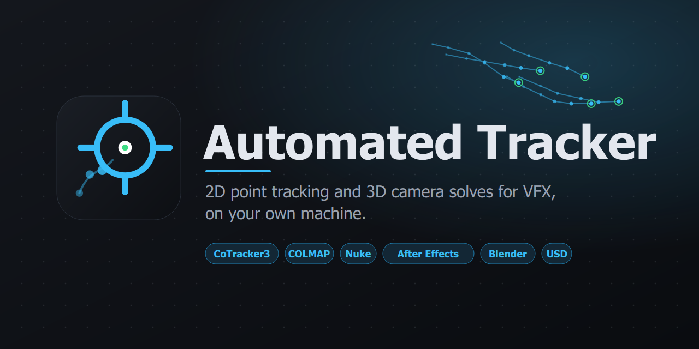

<p align="center">
  
</p>

# Automated Tracker

2D point tracking and 3D camera solves for VFX, on your own machine.
A Windows desktop app that runs Meta's **CoTracker3** for 2D point tracking and
**COLMAP** for 3D camera solves, and exports straight to Nuke, After Effects,
Blender and USD. Everything it needs is bundled; nothing is downloaded at run
time.

**Website:** <https://capsuleutkarsh-design.github.io/automated-tracker/>
(the page lives in [`docs/`](docs/) and is published with GitHub Pages).

## What it does

| 2D Point Tracking · CoTracker3 | 3D Camera Tracking · COLMAP |
|---|---|
| Dense grid, interactive picker, or 4-point corner pin | Shot presets: handheld, drone orbit, 360° VR, long-shot hierarchical, … |
| Offline or streaming model, 512p to original resolution | Seven lens models with optional distortion refinement |
| Named, colour-coded tracking layers | Roto masks keep moving actors out of the solve |
| Keyframed inclusion / exclusion masks | Batch-solve several shots from the media pool |
| Frame cache, loupe, matte and overlay views | Optional environment mesh |

**Exports.** 2D: Nuke Tracker4 / CornerPin2D / Roto `.nk`, After Effects `.jsx`,
Blender `.py`, CSV, JSON, overlay `.mp4`. 3D: Nuke `.nk` and `.chan`, Blender
`.py` and `.blend`, Alembic `.abc`, USD `.usda`, PLY, JSON. A Timeline Start
control shifts every key onto the shot's real frame range.

## Requirements

- Windows 10 / 11, 64-bit
- NVIDIA GPU with CUDA recommended; both engines fall back to the CPU
- About 9 GB of disk for the install

## Install

Download **every** file from the latest release, the setup exe and each
`-1.bin`, `-2.bin`, … beside it, into one folder, then run the exe. The
payload is larger than a single Windows installer can hold, so Inno Setup splits
it; the exe alone installs nothing.

## Run from source

The repository holds the source only. The bundled runtime (Python with PyTorch,
COLMAP, FFmpeg, the CoTracker3 weights) is about 5 GB and lives on the GitHub
release as zip parts. After cloning, run once:

```
SETUP.bat
```

It downloads the parts, verifies their checksums and unpacks them into place,
using only tools that ship with Windows (curl, certutil, tar). Then start the
app with:

```
LAUNCH_UI.bat
```

The folder is a portable layout: `00 PYTHON` (bundled interpreter),
`01 COLMAP`, `02 VIDEOS` (drop clips here), `03 FFMPEG`, `04 SCENES` (output),
`05 SCRIPT` (the app), `06 COTRACKER` (model and weights). Each of the big
folders is tracked as a README only; `SETUP.bat` fills them in.

To rebuild the runtime bundle after changing anything in those folders:

```
"00 PYTHON\python.exe" tools\pack_runtime.py
```

That writes `build/Runtime/runtime_<version>_partNN.zip` plus
`runtime.parts.txt`. Upload all of them to the release alongside the installer.

## Build the installer

```
build\BUILD.bat
```

See [`build/README.md`](build/README.md). The result is
`build/Output/AutomatedTracker_Setup_<version>.exe` plus its `.bin` slices.

## Branding

Logo, mark and banner sources are in [`branding/`](branding/) as SVG.
`branding/make_banner.py` regenerates the banner, and
`branding/render_assets.py` renders the PNGs, the Windows icon and the copies
the site uses.

## Publishing the site

The page is static: `docs/index.html` plus `docs/assets/`. To publish:

1. `REPO` at the bottom of `docs/index.html` holds the repository URL; every
   GitHub, releases and issues link on the page is filled from it.
2. In the repository, open **Settings → Pages**, choose **Deploy from a
   branch**, pick `main` and the `/docs` folder, and save.
3. Upload `branding/png/banner.png` as the social preview under
   **Settings → General → Social preview** so links unfurl with the banner.
4. Attach the setup exe and every `.bin` from `build/Output`, plus the runtime
   parts from `build/Runtime`, to a GitHub Release. `RELEASE_NOTES.md` is the
   text for the release body; the site's download button points at the latest
   release.

## Licences

CoTracker3 and its weights are released by Meta under **CC BY-NC 4.0**, which
permits non-commercial use only. COLMAP is BSD-licensed. FFmpeg is distributed
under its own licence; see `03 FFMPEG/LICENSE`.
