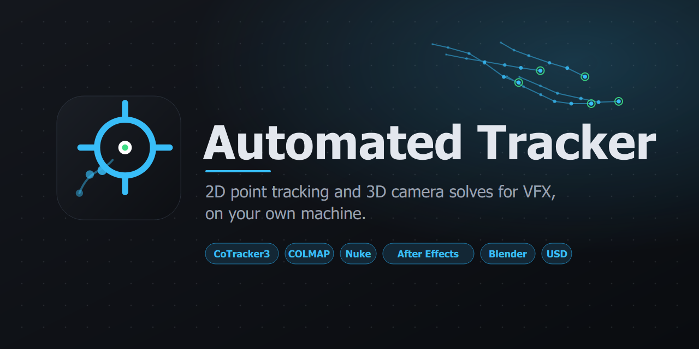
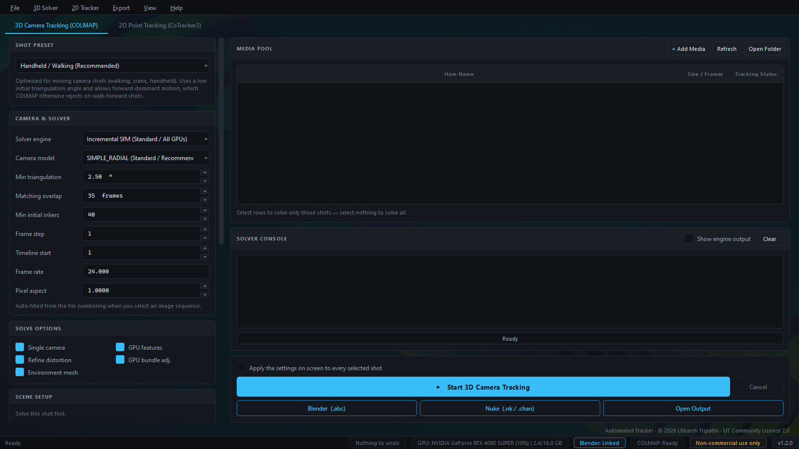
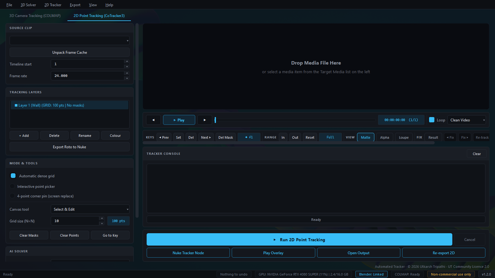
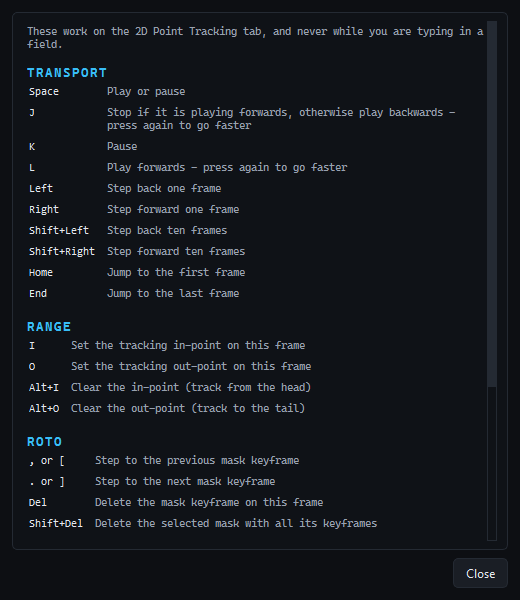
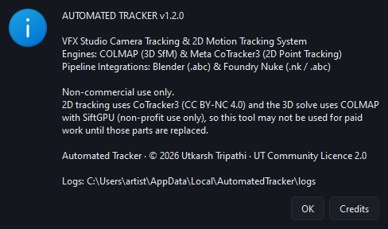
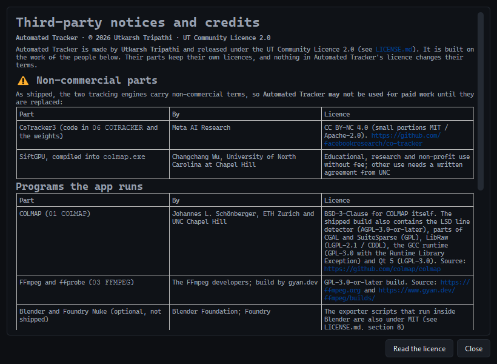

<p align="center">
  
</p>

# Automated Tracker

2D point tracking and 3D camera solves for VFX, on your own machine.
A Windows desktop app that runs Meta's **CoTracker3** for 2D point tracking and
**COLMAP** for 3D camera solves, and exports straight to Nuke, After Effects,
Blender and USD. Everything it needs is bundled; nothing is downloaded at run
time.

For now it is for **non-commercial use only**; see [Licences](#licences).

**Website:** <https://capsuleutkarsh-design.github.io/automated-tracker/>
(the page lives in [`docs/`](docs/) and is published with GitHub Pages).

## What it does

| 2D Point Tracking · CoTracker3 | 3D Camera Tracking · COLMAP |
|---|---|
| Dense grid, interactive picker, or 4-point corner pin | Shot presets: handheld, drone orbit, 360° VR, long-shot hierarchical, … |
| Offline or streaming model, 512p to original resolution | Seven lens models with optional distortion refinement |
| Named, colour-coded tracking layers | Roto masks keep moving actors out of the solve |
| Keyframed inclusion / exclusion masks | Batch-solve several shots from the media pool |
| Frame cache, loupe, matte and overlay views | Optional environment mesh |

**Exports.** 2D: Nuke Tracker4 / CornerPin2D / Roto `.nk`, After Effects `.jsx`,
Blender `.py`, CSV, JSON, overlay `.mp4`. 3D: Nuke `.nk` and `.chan`, Blender
`.py` and `.blend`, Alembic `.abc`, USD `.usda`, PLY, JSON. A Timeline Start
control shifts every key onto the shot's real frame range.

## Quick start

1. **Add a clip.** Click **+ Add Media** in the media pool, or drop a movie on
   the viewer. The clip is copied into the `02 VIDEOS` folder. For an image
   sequence, copy the whole folder of frames into `02 VIDEOS` (one folder per
   shot, frames numbered like `shot.1001.exr`).
2. **Track it.**
   - **2D:** pick the clip on the *2D Point Tracking* tab, add points or a grid
     (and masks if something moves in front), then press
     **Run 2D Point Tracking**.
   - **3D:** on the *3D Camera Tracking* tab, choose a shot preset
     (*Handheld / Walking* suits most shots) and press
     **Start 3D Camera Tracking**.
3. **Find the result** in `04 SCENES/<shot name>/`:
   - 2D: `04 SCENES/<shot>/2D_POINT_TRACK/_latest/`
   - 3D: `04 SCENES/<shot>/3D_CAMERA_TRACK/_latest/`

   `_latest` always holds the newest run. Every run is also kept in its own
   dated folder next to it (for example `2026-09-29_18-58-38`).

## Opening the results in your app

**Nuke**
- Open the `.nk` file in a text editor, copy everything and paste it into the
  Node Graph (Ctrl+V), or use **File > Insert Comp Nodes…** (called
  *Import Script* in older Nuke).
  - 2D: `tracks_2d_nuke.nk` (a Tracker node), plus
    `tracks_2d_cornerpin_nuke.nk` when you asked for a corner pin.
  - 3D: `camera_track_nuke.nk` (plate, camera, point cloud, scene and a
    ScanlineRender, already connected).
- `camera_track.chan` is the camera on its own. Make a Camera node, set its
  **rotation order to XYZ first**, then load the file with the camera's
  *import chan file* button. With any other rotation order the camera points
  the wrong way.

**After Effects** (2D only)
- **File > Scripts > Run Script File…** and pick `tracks_2d_ae.jsx` (or
  `tracks_2d_cornerpin_ae.jsx`). Open your comp first; if no comp is open the
  script makes one.

**Blender**
- Open the **Scripting** tab, open the script in the text editor
  (`import_to_blender.py` for 3D, `tracks_2d_blender.py` for 2D) and press
  **Run Script** (Alt+P). Press Numpad 0 to look through the camera.

**USD and Alembic**
- `camera_track.usda` (camera and points) opens in any app that reads USD,
  for example Houdini, Maya or Blender (**File > Import > Universal Scene
  Description**).
- `camera_track.abc` (Alembic) and `camera_track.blend` are made only when the
  app finds Blender on your machine: it runs Blender in the background to write
  them. If Blender is not found, set its path on the 3D tab (**Browse**).

## Supported footage

- **Movies:** `.mp4`, `.mov`, `.avi`, `.mkv`, `.m4v`
- **Image sequences** (a folder of numbered frames): `.exr`, `.dpx`, `.png`,
  `.jpg` / `.jpeg`, `.tif` / `.tiff`

EXR frames are shown and tracked through a simple linear-to-sRGB view. DPX
frames are read with the bundled FFmpeg; log DPX looks flat on screen, which
does not affect tracking. If a frame cannot be read, the job stops with a
message naming the file instead of crashing.

## Screenshots

**3D Camera Tracking:** shot preset, solver settings, the media pool and the solver console.



**2D Point Tracking:** tracking layers, masks and point tools, the viewer and the tracker console.



| Keyboard shortcuts | About | Credits |
|---|---|---|
|  |  |  |

## Requirements

- Windows 10 / 11, 64-bit
- NVIDIA GPU with CUDA recommended; both engines fall back to the CPU
- About 9 GB of disk for the install

### GPU

- **NVIDIA driver 551.61 or newer.** The tracker is built with CUDA 12.4, and
  that is the Windows driver NVIDIA lists for CUDA 12.4. Update the driver
  first if tracking will not use your GPU.
- **Video memory (VRAM), roughly:** 6 GB or more is comfortable at the
  default 720p working resolution; 8–12 GB for 1080p or *Original*. With
  less, leave *Auto VRAM chunking* on (the default): the clip is sent to the
  GPU a piece at a time, so it still runs, just a little slower.
- **Memory (RAM):** 16 GB is a good minimum, 32 GB for long shots. The whole
  clip is held in memory at the working resolution while it tracks.
- **RTX 50-series cards (RTX 5070, 5080, 5090, …) are not supported yet.**
  The tracker's GPU engine in this version has no code for them. The app
  notices this, says so in the log, and tracks on the CPU instead.
- **No NVIDIA GPU:** everything still works on the CPU, but 2D tracking is
  many times slower (minutes become tens of minutes on a long shot).

### Disk

- The installed app needs about 9 GB.
- Running from source: `SETUP.bat` downloads about 5 GB of zip parts and
  unpacks them next to each other, so it needs room for **both at once**
  (around 15 GB free is safe). The zips are deleted when it finishes.
- Every run is kept in `04 SCENES/<shot>/…` in its own dated folder, and the
  frame caches (`images/`) can be large. Nothing is deleted for you: remove
  old dated run folders (and whole shot folders you no longer need) to get the
  space back. `_latest` is refilled by the next run.

## Install

Download **every** file from the latest release, the setup exe and each
`-1.bin`, `-2.bin`, … beside it, into one folder, then run the exe. The
payload is larger than a single Windows installer can hold, so Inno Setup splits
it; the exe alone installs nothing.

- **Windows SmartScreen:** the installer is not code-signed, so Windows may
  show *"Windows protected your PC"*. Click **More info → Run anyway**.
- **Admin rights:** the installer asks for them, because it installs into
  `Program Files`. The app itself runs as a normal user.
- **Upgrading:** run the new installer over the old one; it installs into
  the same folder. Your clips in `02 VIDEOS` and results in `04 SCENES` are
  kept.
- **Uninstalling:** **Settings → Apps → Automated Tracker → Uninstall**. Your
  own files in `02 VIDEOS` and `04 SCENES` stay behind, as do the logs and
  thumbnails in `%LOCALAPPDATA%\AutomatedTracker`; delete those folders
  yourself if you want them gone.

## Run from source

The repository holds the source only. The bundled runtime (Python with PyTorch,
COLMAP, FFmpeg, the CoTracker3 weights) is about 5 GB and lives on the GitHub
release as zip parts. After cloning, run once:

```
SETUP.bat
```

It downloads the parts for the release that matches this checkout (the version
in `05 SCRIPT/core/version.py`), verifies their checksums and unpacks them into
place, using only tools that ship with Windows (curl, certutil, tar). Then
start the app with:

```
LAUNCH_UI.bat
```

Batch solving is done from the app: select several shots in the media table
(or none, for all of them) and start the 3D solve. The old standalone
`RUN_BATCH.bat` / `batch_reconstruct.bat` COLMAP pipeline duplicated the
worker with different settings and has been removed.

Settings (window layout, Blender path, solver and tracker options, last clip)
persist between runs. Logs and crash reports go to
`%LOCALAPPDATA%\AutomatedTracker\logs`; `LAUNCH_UI.bat` (or the built exe)
with `--selftest` writes a `selftest.txt` health report.

The folder is a portable layout: `00 PYTHON` (bundled interpreter),
`01 COLMAP`, `02 VIDEOS` (drop clips here), `03 FFMPEG`, `04 SCENES` (output),
`05 SCRIPT` (the app), `06 COTRACKER` (model and weights). Each of the big
folders is tracked as a README only; `SETUP.bat` fills them in.

To rebuild the runtime bundle after changing anything in those folders:

```
"00 PYTHON\python.exe" tools\pack_runtime.py
```

That writes `build/Runtime/runtime_<version>_partNN.zip` plus
`runtime.parts.txt`. Upload all of them to the release alongside the installer.

## Troubleshooting

**The app will not start after SETUP, or says it cannot load PyTorch.**
Windows limits a file path to 260 characters unless long paths are turned on,
and some files inside the runtime sit deep in their folders. `SETUP.bat` warns
when the folder's own path is long. Move the whole folder somewhere short,
such as `C:\automated-tracker`, or turn on long paths in Windows, then run
`SETUP.bat` again.

**"CUDA out of memory" while 2D tracking.**
- Leave **Auto VRAM chunking** on.
- Pick a lower **Resolution** (720p, or 512p) on the 2D tab.
- Close other programs that use the GPU (games, browsers with many tabs,
  other 3D or comp apps).
- Track a shorter range with the **In** / **Out** points.

**The 3D solve registers only a few frames** (the log says
*"COLMAP solved only X of Y frames"*). The app already retries with looser
settings on its own. If it still fails:
- The camera has to **move**, not just turn: a tripod pan or a locked-off
  shot has too little parallax for a 3D solve.
- Try the preset that matches the shot (*Slow / Subtle Motion* for small
  moves, *Fast Action* for quick turns, *Action Cam / GoPro / Fisheye* for wide
  lenses).
- Use a smaller **Frame step** (1 uses every frame).
- Mask out people, cars and anything else moving with a roto mask on the 2D
  tab; the 3D solve leaves masked areas out.
- Heavy motion blur and plain walls or sky give it little to hold on to.

Logs are in `%LOCALAPPDATA%\AutomatedTracker\logs`. `app.log` is the file to
send with a bug report.

## Support

- Report a problem or ask a question on
  [GitHub Issues](https://github.com/capsuleutkarsh-design/automated-tracker/issues).
- Or email **capsuleutkarsh@gmail.com**.

Please include what you did, what you expected, and your `app.log`.

## Build the installer

```
build\BUILD.bat
```

See [`build/README.md`](build/README.md). The result is
`build/Output/AutomatedTracker_Setup_<version>.exe` plus its `.bin` slices.

## Branding

Logo, mark and banner sources are in [`branding/`](branding/) as SVG.
`branding/make_banner.py` regenerates the banner, and
`branding/render_assets.py` renders the PNGs, the Windows icon and the copies
the site uses.

## Publishing the site

The page is static: `docs/index.html` plus `docs/assets/`. To publish:

1. `REPO` at the bottom of `docs/index.html` holds the repository URL; every
   GitHub, releases and issues link on the page is filled from it.
2. In the repository, open **Settings → Pages**, choose **Deploy from a
   branch**, pick `main` and the `/docs` folder, and save.
3. Upload `branding/png/banner.png` as the social preview under
   **Settings → General → Social preview** so links unfurl with the banner.
4. Attach the setup exe and every `.bin` from `build/Output`, plus the runtime
   parts from `build/Runtime`, to a GitHub Release. `RELEASE_NOTES.md` is the
   text for the release body; the site's download button points at the latest
   release.

## Licences

Automated Tracker is released under the **[UT Community Licence 2.0](LICENSE.md)** by
Utkarsh Tripathi: free to use, not for sale; if you change it, keep the name as
*Automated Tracker (modified by …)* and send your changes back as a pull request
within 30 days; keep the credits and the *Automated Tracker · © 2026 Utkarsh
Tripathi · UT Community Licence 2.0* line under the tabs, or the app will not
start. The full list of third-party parts is in
[THIRD_PARTY_NOTICES.md](THIRD_PARTY_NOTICES.md) and on the Credits screen.

As shipped, Automated Tracker is for **non-commercial use only**: each of its
two engines contains a part whose licence does not allow commercial use.

- **CoTracker3** (the 2D tab). Meta releases the code and the weights under
  **CC BY-NC 4.0**, which permits non-commercial use only; see
  `06 COTRACKER/LICENSE.md` (the file appears after SETUP.bat has run, and is
  installed with the app).
- **COLMAP** (the 3D solve). COLMAP's own code is BSD-licensed, but its
  third-party parts are licensed separately, and the `colmap.exe` shipped here
  is built with some that are not BSD:
  - **SiftGPU** (University of North Carolina at Chapel Hill) may be used only
    for educational, research and non-profit purposes. It runs in every 3D
    solve on a machine with a CUDA GPU.
  - The **LSD** line detector is under **AGPL-3.0**.
  - **CGAL** and parts of **SuiteSparse** are under the **GPL**.

  The AGPL and GPL parts do not forbid paid work, but they come with their own
  conditions on passing the program on.

FFmpeg is distributed under its own licence; see `03 FFMPEG/LICENSE` (the file
appears after SETUP.bat has run, and is installed with the app).

### Commercial use

Do not use this tool for paid or client work as it stands. That needs
CoTracker3 replaced with a tracker whose licence allows commercial use, and
COLMAP rebuilt without SiftGPU, with the AGPL and GPL parts checked. Until then
the app shows a "Non-commercial use only" chip in its status bar.
